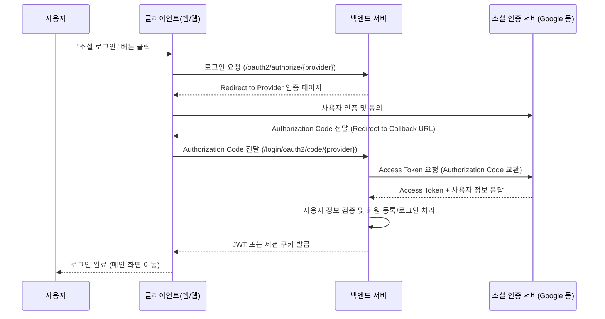
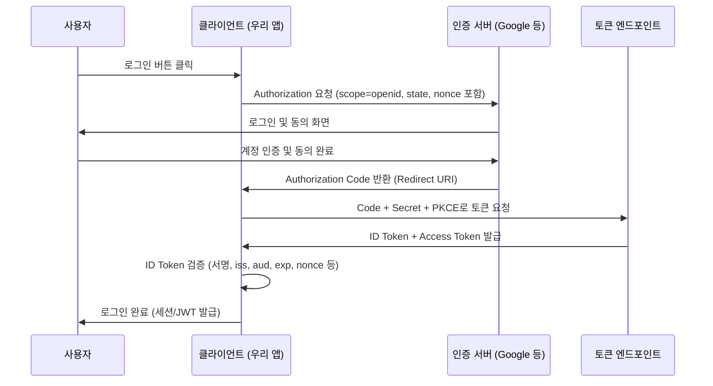

# Kotlin-Open-Mission

## Social Login

소셜 로그인은 사용자가 별도의 회원가입 없이 이미 가입된 소셜 서비스(Google, Kakao, Naver 등) 계정을 이용해 로그인하는 방식

- 서비스에서 ID/PW를 새로 만들 필요 없음
- 외부 인증 서버가 인증을 대신함
- 서버는 인증 결과만 받아서 로그인 처리
- OAuth 2.0 프로토콜을 기반으로 동작

## 핵심 개념

[1. OAuth 2.0](#oauth-20)

[2. 인증 흐름](#인증-흐름)

[3. OIDC](#oidc-openid-connect)

[4. PKCE](#pkce-proof-key-for-code-exchange)

[5. Spring Security](#spring-security)

### OAuth 2.0

OAuth 2.0은 권한 위임(Authorization)을 위한 표준 프로토콜<br>
사용자가 자신의 정보를 직접 제공하지 않고, 제3자 애플리케이션이 대신 접근할 수 있도록 허락하는 방식

| 용어                       | 설명                             |
|--------------------------|--------------------------------|
| **Resource Owner**       | 실제 사용자                         |
| **Authorization Server** | 소셜 로그인 제공자 (Google, Kakao 등)   |
| **Resource Server**      | 사용자 정보가 저장된 서버                 |
| **Client**               | 우리 앱 (Kotlin + Spring Boot 서버) |
| **Access Token**         | API 호출 권한을 증명하는 토큰             |
| **Refresh Token**        | Access Token 재발급용 토큰           |

### 인증 흐름



1. 사용자가 "Google로 로그인" 클릭
2. Google 로그인 페이지로 이동
3. 사용자 로그인 + 동의
4. Authorization Code 발급 (일회용 코드)
5. 우리 서버가 Code로 Access Token 요청
6. Google이 Access Token + Refresh Token 응답
7. Access Token으로 사용자 정보 요청
8. 사용자 정보로 회원가입/로그인 처리

### OIDC (OpenID Connect)

OIDC는 OAuth 2.0을 확장해 누가 로그인했는지를 인증(Authentication)해 주는 표준 규약이다.<br>
OAuth 2.0은 권한 위임(Authorization)이고, OIDC는 인증을 얹어 ID Token (JWT)를 제공한다.

> Authentication vs Authorization<br>
>
> 인증(Authentication): 사용자의 신원을 확인하는 과정, 로그인과 같은 방식으로 사용자가 누구인지 증명<br>
> 인가(Authorization): 인증된 사용자에게 특정 자원에 대한 접근 권한을 부여하는 과정, 접근 제어를 위해 사용

| 구성 요소                             | 설명                                       |
|-----------------------------------|------------------------------------------|
| **ID Token**                      | 사용자의 인증 정보를 담은 JWT 토큰 (누가 로그인했는가를 증명)    |
| **Access Token**                  | 보호된 리소스(API)에 접근할 수 있는 권한 토큰             |
| **UserInfo Endpoint**             | Access Token으로 추가 사용자 정보를 가져오는 API       |
| **Authorization Server (Issuer)** | 인증 및 토큰 발급을 담당하는 서버 (예: Google, Kakao 등) |
| **Client (RP)**                   | 사용자 인증을 요청하는 애플리케이션 (우리 서비스)             |

```text
// ID Token

{
  "iss": "https://accounts.example.com",    // 토큰을 발급한 서버의 URL
  "sub": "248289761001",                    // 사용자의 고유 식별자
  "aud": "s6BhdRkqt3",                      // 토큰의 수신자 또는 사용 대상
  "exp": 1311281970,                        // 토큰 만료 시간
  "iat": 1311280970,                        // 토큰 발급 시간
  "nonce": "n-0S6_WzA2Mj",                  // 재생 공격 방지를 위한 무작위 문자열
  "email": "janedoe@example.com",           // 사용자 이메일
  "email_verified": true,                   
  "name": "Jane Doe",                       // 사용자의 이름
  "picture": "https://..."                  // 프로필 사진 URL
}

```

### PKCE (Proof Key for Code Exchange)

모바일 앱이나 SPA(Single Page Application)는 client_secret을 숨기기 어려움. 이를 해결하기 위해 Authorization Code에 PKCE를 추가해서 token을 발급<br>
동작 방식

- 앱이 랜덤 문자열(code_verifier) 생성
- 랜덤 문자열을 해시해서(code_challenge) Authorization 요청할 때 같이 보냄
- 토큰 교환할 때 다시 원본 code_verifier를 보냄
- 인증서버는 이게 맞는지 확인



### Spring Security

인증과 인가를 처리하기 위한 Spring 기반의 강력한 보안 프레임워크

| 개념                        | 설명                                                |
|---------------------------|---------------------------------------------------|
| **Authentication (인증)**   | 사용자가 누구인지 확인하는 과정. 예: 로그인                         |
| **Authorization (인가)**    | 인증된 사용자가 어떤 자원에 접근할 수 있는지 결정하는 과정                 |
| **Principal**             | 인증된 사용자(혹은 시스템)의 식별자 정보. 예: 사용자 ID, 이메일           |
| **GrantedAuthority**      | 사용자가 가진 권한(Role). 예: `ROLE_USER`, `ROLE_ADMIN`    |
| **SecurityContext**       | 현재 인증된 사용자 정보를 저장하는 컨텍스트                          |
| **SecurityContextHolder** | 스레드 로컬(ThreadLocal)을 통해 SecurityContext를 보관하는 클래스 |

#### Security OAuth 2.0 / OIDC

Spring Security는 OAuth2.0과 OpenID Connect를 기본적으로 지원한다.<br>
Spring Security는 내부적으로 다음을 자동으로 처리

- Authorization Code 요청
- Redirect URI 처리
- Access Token 교환
- 사용자 프로필 정보 조회 및 인증 객체 생성

#### Security PKCE

Spring Security는 PKCE도 지원한다.<br>
yaml 파일에 다음과 같이 설정하여 PKCE를 설정한다.

```yaml
spring:
  security:
    oauth2:
      authorizationserver:
        client:
          public-client:
            registration:
              client-id: "public-client"
              client-authentication-methods:
                - "none"
              authorization-grant-types:
                - "authorization_code"
              redirect-uris:
                - "http://127.0.0.1:4200"
              scopes:
                - "openid"
                - "profile"
            require-authorization-consent: true
            require-proof-key: true
```

### 참고 자료

[OAuth & OIDC 관련 블로그](https://sabarada.tistory.com/264)

[Spring Security PKCE 공식 문서](https://docs.spring.io/spring-authorization-server/reference/guides/how-to-pkce.html)

## Social Login 구현

### Domain

- [x] User: 회원 정보를 저장하는 객체
    - [x] id: table의 primary key 값
    - [x] email: 유저 email
    - [x] name: 유저 이름
- [x] Role: 회원의 권한을 설정하는 enum
- [ ] token: accessToken, refreshToken을 저장하는 객체
    - [ ] accessToken
    - [ ] refreshToken
- [x] RefreshToken: redis에 refreshToken을 저장하기 위한 엔티티
- [x] JwtTokenProvider: JwtToken 생성/조회

### Repository

- [x] UserRepository: JPA를 활용해서 User 저장/조회
- [x] RefreshTokenRepository: refreshToken 저장/조회/삭제 (accessToken은 DB에 저장x)

### Service

- [ ] UserService: User 생성/조회/수정 로직 처리
    - [ ] registerUser(): user의 정보를 저장하는 메서드
- [ ] TokenService: JWT Token 생성/검증 로직 처리

- [x] OAuthUserInfo: 유저 정보 인터페이스
- [x] GoogleOAuthUserInfo: 구글로 부터 구글 유저 데이터를 처리
- [x] OAuthAttributes: 각 소셜 로그인 인증서버로 부터 OAuthUserInfo를 만듬
    - Google, Kakao, Naver ...
- [x] OAuthUserDetails: Spring Security에서 유저의 정보를 가져오고 처리하기 위한 객체
- [x] CustomOAuth2UserService: Spring Security가 Authorization Code로 유저 정보 가져올 때 동작하는 서비스

### Controller

- [ ] AuthController: Authorization code를 받고 인증 처리

> PKCE 처리를 위해 Authorization code를 직접 받고 처리해야함<br>
> 모바일 앱 + 백엔드 분리 구조라면 Authorization code를 직접 받고 Controller에서 교환해야함<br>
> Web으로 진행하면 Security가 대신 PKCE를 처리해줌